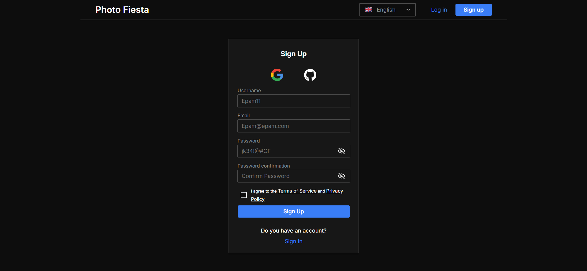

# Photo-Fiesta

Photo-Fiesta is an Instagram clone that offers a comprehensive social media experience. Built with a microservices architecture using the Feature-Sliced Design (FSD) approach, this project showcases modern web development practices and technologies. Visit the live version at [https://photo-fiesta.online/](https://photo-fiesta.online/).



## Features

- **Authentication**: Secure login with Google and GitHub OAuth2, JWT and Refresh Tokens
- **User Profiles**: Customizable profiles with activity feeds
- **Posts**: Create, edit, delete, and interact with posts
- **Media Sharing**: Upload and share photos
- **Interactions**: Like and comment on posts
- **Stories**: Share temporary content
- **Messaging**: Real-time chat using WebSockets
- **Statistics**: Track account performance
- **Payment Integration**: Secure payment system for premium features

## Technologies

- TypeScript, Next.js, Redux Toolkit (RTK Query)
- React Hook Form, Custom UI library [@photo-fiesta/ui-lib](https://www.npmjs.com/package/@photo-fiesta/ui-lib)
- Docker, Jenkins, Husky, Vite
- SASS, ESLint, Prettier, Stylelint

## Getting Started

To run Photo-Fiesta locally:

1. Clone the repository `git clone https://github.com/it-incubator/photo-fiesta.git`
2. Install dependencies: `pnpm install`
3. Set up environment variables
4. Run the development server: `pnpm run dev`

Visit `http://localhost:3000` to view the application.

## Development

### Requirements

Node.js v14+ and pnpm are required to install and run the project.

### Installing Dependencies

To install dependencies, run:

```bash
pnpm install
```

### Running Development Server

To start the development server, execute:

```bash
pnpm run dev
```

### Creating a Production Build

To create a production build, use:

```bash
pnpm run build
```

### Running Tests

To run the test suite, use:

```bash
pnpm run test
```

## Deployment

The application is deployed at [https://photo-fiesta.online/](https://photo-fiesta.online/). For detailed deployment instructions, please refer to our deployment documentation.

## Contributing

We welcome contributions! Please read our [contributing guidelines](./contributing.md) before submitting pull requests.

## License

This project is currently not licensed. All rights are reserved by the project owners. No permission is granted to use, modify, or share this software for any purpose.😉